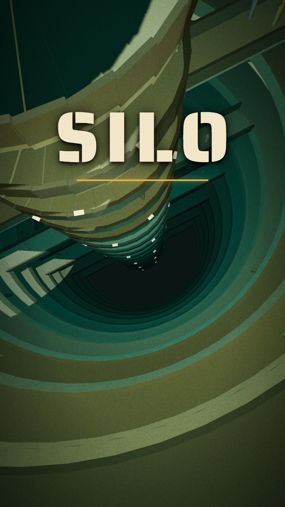
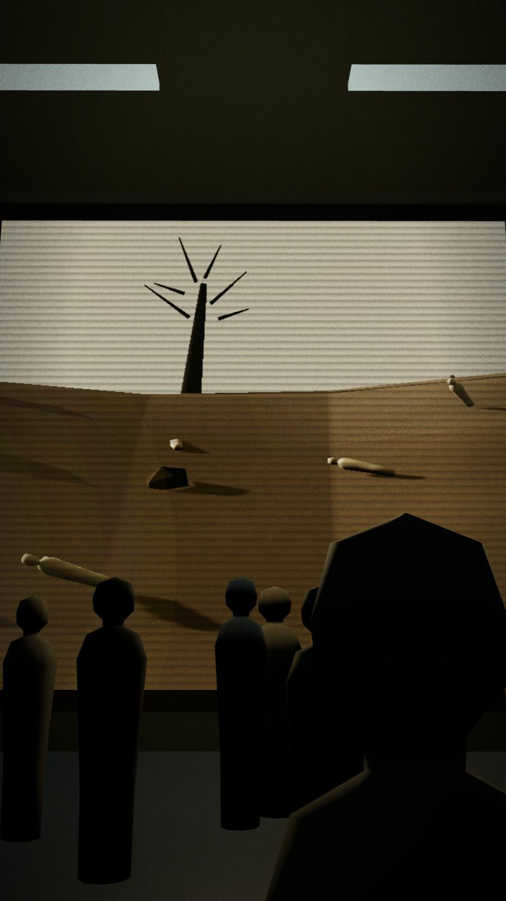
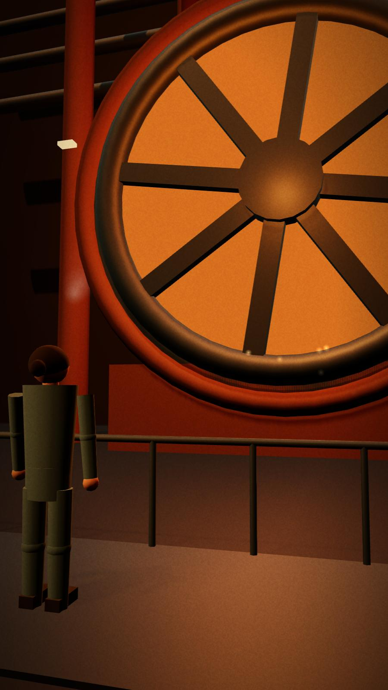
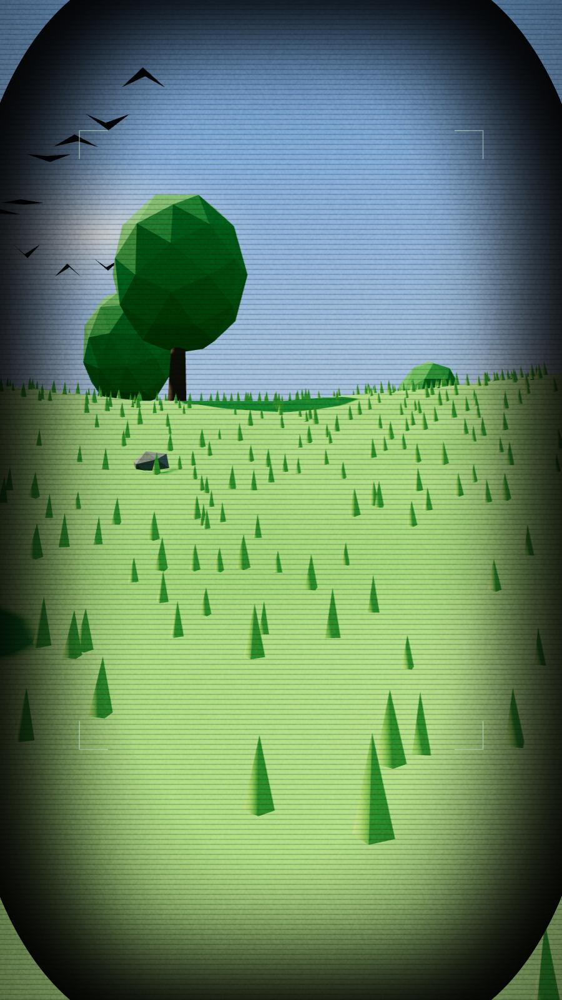
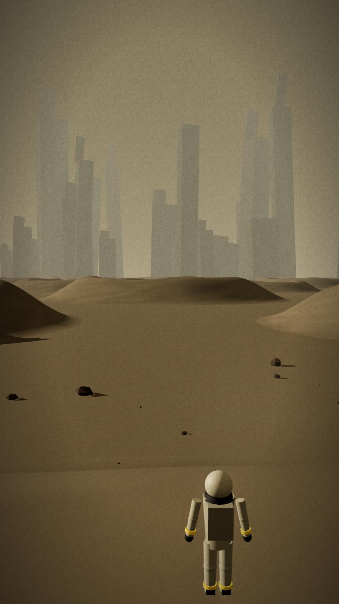
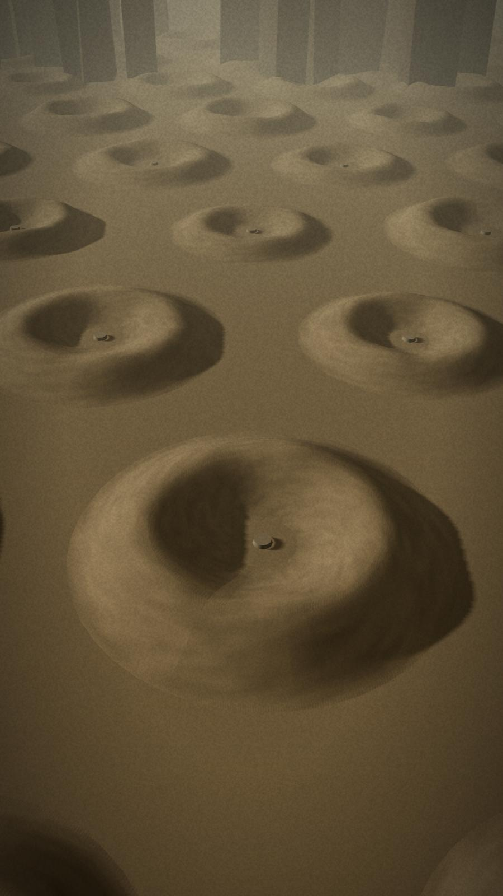

# SILO — a one-minute animation, made by Claude

The story of season 1 of the TV series *Silo*, told in 60 seconds without a single word. A vertical (9:16) 3D animated short that runs in the browser.

**▶ Watch it: https://qalbasia.github.io/silo-tv-show-animation-made-by-claude/**

Press **PLAY**. It looks best on a phone held upright, or in a tall browser window. Contains spoilers for season 1.

  
  
  

  
  
  

These are frames from the film as it runs in the browser, not drawings.

## Made by Claude Opus 5.5

The whole film was written by **Claude Opus 5.5** in Claude Code, from one short request in plain English: *"make a 1 minute animation for the Silo series, no voice, with sound effects and background music."* Claude wrote the 3D world, the characters, the camera, the editing and the sound, then opened the film in a browser and checked every shot itself.

There are no video files, no 3D models and no audio files in this repository:

- Everything you see is drawn live with [three.js](https://threejs.org/) from simple shapes.
- Everything you hear (music and sound effects) is made in the browser with the Web Audio API.
- The whole film is about 120 KB of text.

## What is inside

| File | What it is |
|------|------------|
| `index.html` | The page: menu, title, end card, seek bar |
| `js/story.js` | The 18 beats of the film and how long each one lasts |
| `js/cinematic.js` | The 3D world, the characters and every shot |
| `js/sound.js` | The music and the sound effects |
| `start.bat`, `serve.js` | Windows: double-click `start.bat` to watch on your computer and get a link for your phone (needs [Node.js](https://nodejs.org)) |

Every frame is worked out from the timeline time alone, so pause, skip and the seek bar always show exactly the same picture.

## Keys

Space pause · ← → skip 5 s · M sound · H hide the time bar · F fullscreen · Esc menu. On a phone, tap the picture to show the time bar.

## Note

This is an **unofficial fan-made animation**. It is not connected to or approved by Apple TV+, AMC Studios or Hugh Howey, the author of the *Silo* books. No footage, images, music or dialogue from the series is used; all pictures and sounds were made from scratch.

A Qalb Asia production.
